# Database Schema — Pluralscape (PostgreSQL)

This document contains entity-relationship diagrams for every table in the Pluralscape PostgreSQL schema, organized by domain. Each diagram uses [Mermaid `erDiagram` syntax](https://mermaid.js.org/syntax/entityRelationshipDiagram.html).

**Conventions used throughout:**

- `PK` — primary key column
- `FK` — foreign key column
- `encrypted` — column is an E2E-encrypted blob (XChaCha20-Poly1305 via libsodium). Encrypted blobs are omitted from individual column lists but noted on the table.
- `T1` — Tier 1 encryption: encrypted with the per-user (account) key
- `T2` — Tier 2 encryption: encrypted with a per-bucket symmetric key; shareable with friends
- Columns named `version`, `created_at`, `updated_at`, `archived`, `archived_at` appear on most tables via shared helpers and are omitted from diagrams to reduce noise.

**All string IDs** are `varchar(36)` (KSUID/UUID-shaped). Composite foreign keys using `(id, system_id)` pairs are noted as "scoped FK" in descriptions.

---

## 1. Auth

Core authentication and credential tables. All sensitive blobs here are T1 (per-account encryption).

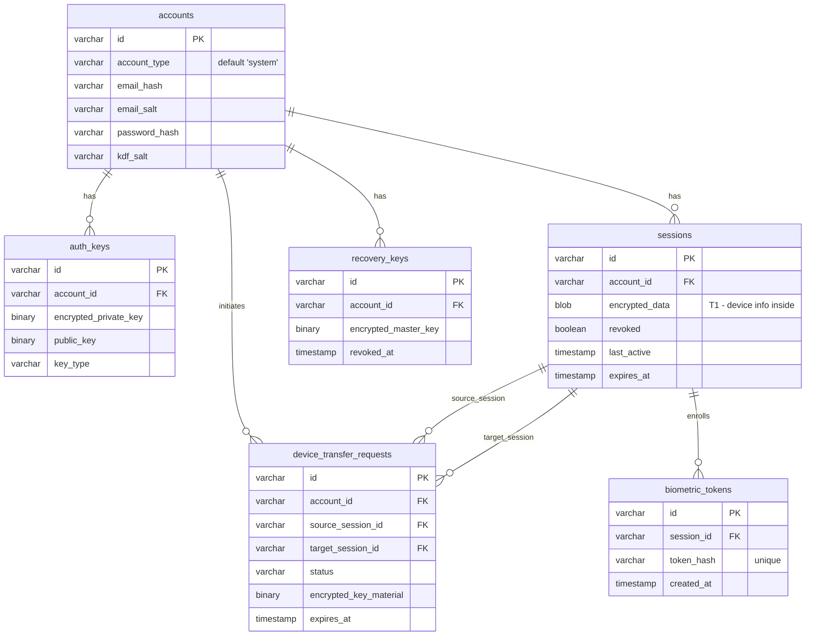
```mermaid
erDiagram
    accounts {
        varchar id PK
        varchar account_type "default 'system'"
        varchar email_hash
        varchar email_salt
        varchar password_hash
        varchar kdf_salt
    }

    auth_keys {
        varchar id PK
        varchar account_id FK
        binary encrypted_private_key
        binary public_key
        varchar key_type
    }

    sessions {
        varchar id PK
        varchar account_id FK
        blob encrypted_data "T1 - device info inside"
        boolean revoked
        timestamp last_active
        timestamp expires_at
    }

    recovery_keys {
        varchar id PK
        varchar account_id FK
        binary encrypted_master_key
        timestamp revoked_at
    }

    device_transfer_requests {
        varchar id PK
        varchar account_id FK
        varchar source_session_id FK
        varchar target_session_id FK
        varchar status
        binary encrypted_key_material
        timestamp expires_at
    }

    biometric_tokens {
        varchar id PK
        varchar session_id FK
        varchar token_hash "unique"
        timestamp created_at
    }

    accounts ||--o{ auth_keys : "has"
    accounts ||--o{ sessions : "has"
    accounts ||--o{ recovery_keys : "has"
    accounts ||--o{ device_transfer_requests : "initiates"
    sessions ||--o{ device_transfer_requests : "source_session"
    sessions ||--o{ device_transfer_requests : "target_session"
    sessions ||--o{ biometric_tokens : "enrolls"
```

---

## 2. Systems & Settings

A `system` is the top-level entity for a plural system — one per `account`. Settings tables hang off `systems` with 1:1 relationships.

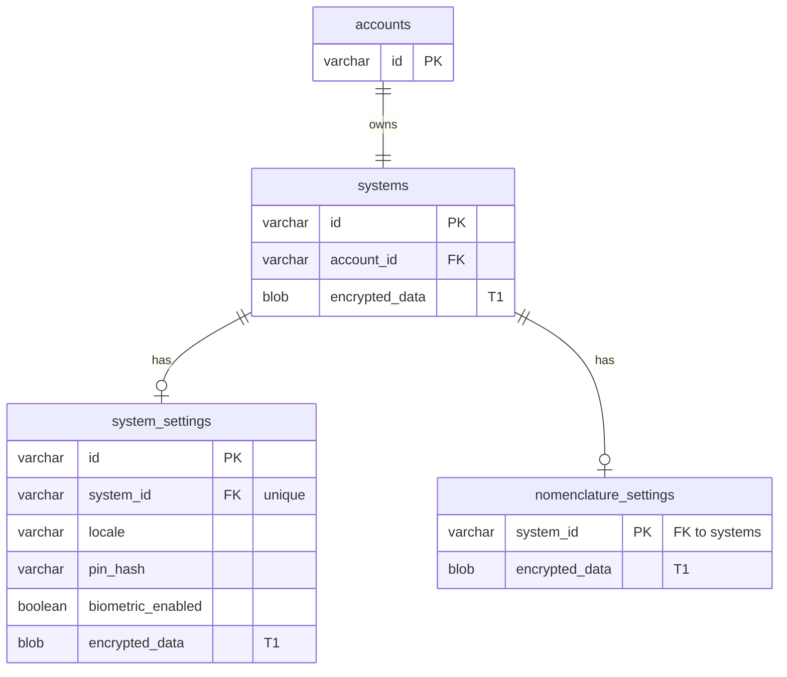
```mermaid
erDiagram
    accounts {
        varchar id PK
    }

    systems {
        varchar id PK
        varchar account_id FK
        blob encrypted_data "T1"
    }

    system_settings {
        varchar id PK
        varchar system_id FK "unique"
        varchar locale
        varchar pin_hash
        boolean biometric_enabled
        blob encrypted_data "T1"
    }

    nomenclature_settings {
        varchar system_id PK "FK to systems"
        blob encrypted_data "T1"
    }

    accounts ||--|| systems : "owns"
    systems ||--o| system_settings : "has"
    systems ||--o| nomenclature_settings : "has"
```

---

## 3. Members & Structure

Members (headmates/alters) and the structural containers that organize them. Groups provide hierarchical folders. Structure entity types are user-defined per system (e.g. "Subsystem", "Side System", "Layer"), providing a generic, extensible hierarchy with entity-to-entity links, member-to-entity links, and directed entity associations. All member data is T1-encrypted.

### 3a. Members & Groups

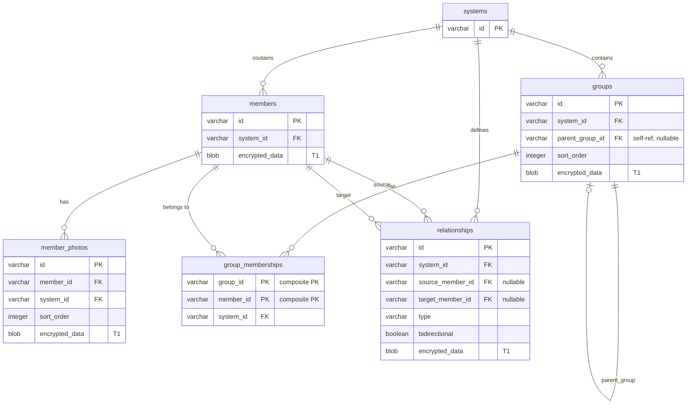
```mermaid
erDiagram
    systems {
        varchar id PK
    }

    members {
        varchar id PK
        varchar system_id FK
        blob encrypted_data "T1"
    }

    member_photos {
        varchar id PK
        varchar member_id FK
        varchar system_id FK
        integer sort_order
        blob encrypted_data "T1"
    }

    groups {
        varchar id PK
        varchar system_id FK
        varchar parent_group_id FK "self-ref, nullable"
        integer sort_order
        blob encrypted_data "T1"
    }

    group_memberships {
        varchar group_id PK "composite PK"
        varchar member_id PK "composite PK"
        varchar system_id FK
    }

    relationships {
        varchar id PK
        varchar system_id FK
        varchar source_member_id FK "nullable"
        varchar target_member_id FK "nullable"
        varchar type
        boolean bidirectional
        blob encrypted_data "T1"
    }

    systems ||--o{ members : "contains"
    members ||--o{ member_photos : "has"
    systems ||--o{ groups : "contains"
    groups ||--o| groups : "parent_group"
    groups ||--o{ group_memberships : "has"
    members ||--o{ group_memberships : "belongs to"
    systems ||--o{ relationships : "defines"
    members ||--o{ relationships : "source"
    members ||--o{ relationships : "target"
```

### 3b. Structure Entities

Structure entity types are user-defined per system — for example, a system might create types called "Subsystem", "Side System", and "Layer". Entities are instances of those types. Entity links form hierarchical trees (entities within entities). Member links connect members to entities. Associations are directed cross-references between entities. All entity type and entity names/metadata are inside `encrypted_data` (T1).

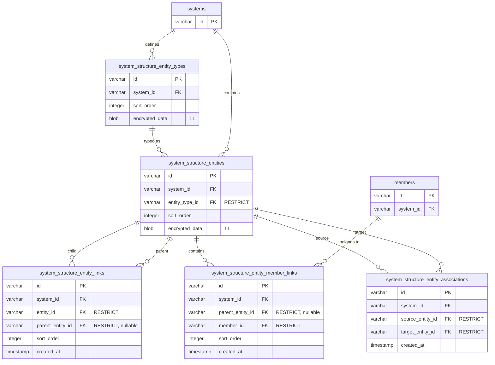
```mermaid
erDiagram
    systems {
        varchar id PK
    }

    members {
        varchar id PK
        varchar system_id FK
    }

    system_structure_entity_types {
        varchar id PK
        varchar system_id FK
        integer sort_order
        blob encrypted_data "T1"
    }

    system_structure_entities {
        varchar id PK
        varchar system_id FK
        varchar entity_type_id FK "RESTRICT"
        integer sort_order
        blob encrypted_data "T1"
    }

    system_structure_entity_links {
        varchar id PK
        varchar system_id FK
        varchar entity_id FK "RESTRICT"
        varchar parent_entity_id FK "RESTRICT, nullable"
        integer sort_order
        timestamp created_at
    }

    system_structure_entity_member_links {
        varchar id PK
        varchar system_id FK
        varchar parent_entity_id FK "RESTRICT, nullable"
        varchar member_id FK "RESTRICT"
        integer sort_order
        timestamp created_at
    }

    system_structure_entity_associations {
        varchar id PK
        varchar system_id FK
        varchar source_entity_id FK "RESTRICT"
        varchar target_entity_id FK "RESTRICT"
        timestamp created_at
    }

    systems ||--o{ system_structure_entity_types : "defines"
    system_structure_entity_types ||--o{ system_structure_entities : "typed as"
    systems ||--o{ system_structure_entities : "contains"
    system_structure_entities ||--o{ system_structure_entity_links : "child"
    system_structure_entities ||--o{ system_structure_entity_links : "parent"
    system_structure_entities ||--o{ system_structure_entity_member_links : "contains"
    members ||--o{ system_structure_entity_member_links : "belongs to"
    system_structure_entities ||--o{ system_structure_entity_associations : "source"
    system_structure_entities ||--o{ system_structure_entity_associations : "target"
```

**Notes:**

- `system_structure_entity_links` has a unique constraint on `(entity_id, parent_entity_id)` — in PostgreSQL via NULLS NOT DISTINCT; in SQLite via a partial unique index on the null case. A null `parent_entity_id` means the entity is at the root level of its hierarchy.
- `system_structure_entity_member_links` has a unique constraint on `(member_id, parent_entity_id)` — in PostgreSQL via NULLS NOT DISTINCT; in SQLite via a partial unique index on the null case.
- `system_structure_entity_associations` has a unique constraint on `(source_entity_id, target_entity_id)` and a CHECK constraint preventing self-links. Both directions (A→B) and (B→A) are allowed as distinct associations.
- All entity-to-entity and member-to-entity FKs use composite `(id, system_id)` scoped FKs with ON DELETE RESTRICT.

---

## 4. Communication

Internal system communication: threaded channels/messages, a shared bulletin board, per-member notes, polls with voting, and acknowledgements.

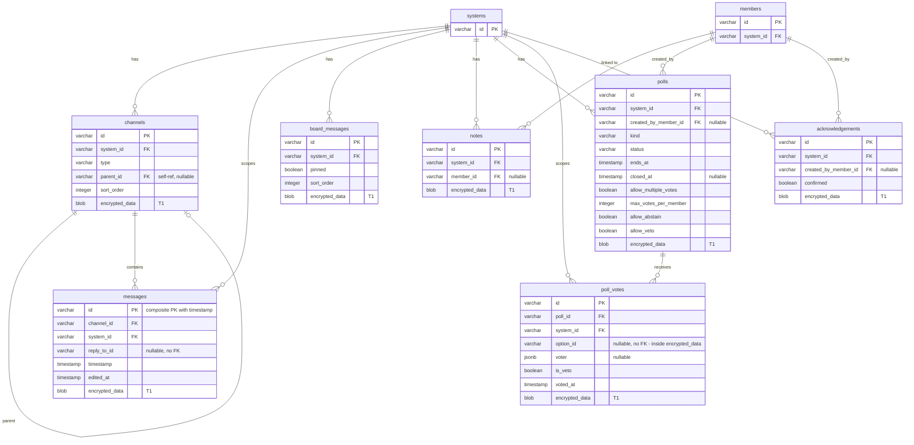
```mermaid
erDiagram
    systems {
        varchar id PK
    }

    members {
        varchar id PK
        varchar system_id FK
    }

    channels {
        varchar id PK
        varchar system_id FK
        varchar type
        varchar parent_id FK "self-ref, nullable"
        integer sort_order
        blob encrypted_data "T1"
    }

    messages {
        varchar id PK "composite PK with timestamp"
        varchar channel_id FK
        varchar system_id FK
        varchar reply_to_id "nullable, no FK"
        timestamp timestamp
        timestamp edited_at
        blob encrypted_data "T1"
    }

    board_messages {
        varchar id PK
        varchar system_id FK
        boolean pinned
        integer sort_order
        blob encrypted_data "T1"
    }

    notes {
        varchar id PK
        varchar system_id FK
        varchar member_id FK "nullable"
        blob encrypted_data "T1"
    }

    polls {
        varchar id PK
        varchar system_id FK
        varchar created_by_member_id FK "nullable"
        varchar kind
        varchar status
        timestamp ends_at
        timestamp closed_at "nullable"
        boolean allow_multiple_votes
        integer max_votes_per_member
        boolean allow_abstain
        boolean allow_veto
        blob encrypted_data "T1"
    }

    poll_votes {
        varchar id PK
        varchar poll_id FK
        varchar system_id FK
        varchar option_id "nullable, no FK - inside encrypted_data"
        jsonb voter "nullable"
        boolean is_veto
        timestamp voted_at
        blob encrypted_data "T1"
    }

    acknowledgements {
        varchar id PK
        varchar system_id FK
        varchar created_by_member_id FK "nullable"
        boolean confirmed
        blob encrypted_data "T1"
    }

    systems ||--o{ channels : "has"
    channels ||--o| channels : "parent"
    channels ||--o{ messages : "contains"
    systems ||--o{ messages : "scopes"
    systems ||--o{ board_messages : "has"
    systems ||--o{ notes : "has"
    members ||--o{ notes : "linked to"
    systems ||--o{ polls : "has"
    members ||--o{ polls : "created_by"
    polls ||--o{ poll_votes : "receives"
    systems ||--o{ poll_votes : "scopes"
    systems ||--o{ acknowledgements : "has"
    members ||--o{ acknowledgements : "created_by"
```

---

## 5. Fronting

Tracks who is fronting, when switches occurred, and comments on fronting sessions. Supports overlapping sessions (co-fronting). Custom fronts are abstract cognitive states (e.g., "Dissociated") that can front like a member.

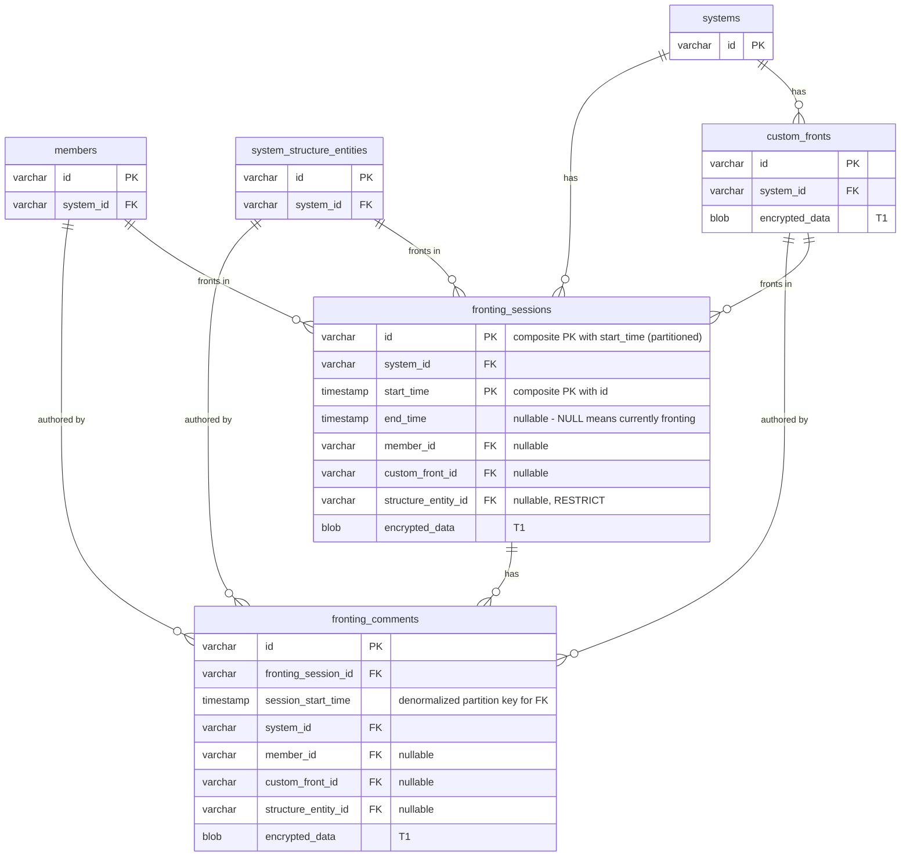
```mermaid
erDiagram
    systems {
        varchar id PK
    }

    members {
        varchar id PK
        varchar system_id FK
    }

    system_structure_entities {
        varchar id PK
        varchar system_id FK
    }

    custom_fronts {
        varchar id PK
        varchar system_id FK
        blob encrypted_data "T1"
    }

    fronting_sessions {
        varchar id PK "composite PK with start_time (partitioned)"
        varchar system_id FK
        timestamp start_time PK "composite PK with id"
        timestamp end_time "nullable - NULL means currently fronting"
        varchar member_id FK "nullable"
        varchar custom_front_id FK "nullable"
        varchar structure_entity_id FK "nullable, RESTRICT"
        blob encrypted_data "T1"
    }

    fronting_comments {
        varchar id PK
        varchar fronting_session_id FK
        timestamp session_start_time "denormalized partition key for FK"
        varchar system_id FK
        varchar member_id FK "nullable"
        varchar custom_front_id FK "nullable"
        varchar structure_entity_id FK "nullable"
        blob encrypted_data "T1"
    }

    systems ||--o{ custom_fronts : "has"
    systems ||--o{ fronting_sessions : "has"
    members ||--o{ fronting_sessions : "fronts in"
    custom_fronts ||--o{ fronting_sessions : "fronts in"
    system_structure_entities ||--o{ fronting_sessions : "fronts in"
    fronting_sessions ||--o{ fronting_comments : "has"
    members ||--o{ fronting_comments : "authored by"
    custom_fronts ||--o{ fronting_comments : "authored by"
    system_structure_entities ||--o{ fronting_comments : "authored by"
```

**Notes:**

- **Session subject constraint:** Every fronting session must have at least one of `member_id`, `custom_front_id`, or `structure_entity_id` (enforced by CHECK). Structure entity fronting is represented by a session with `structure_entity_id` set.
- **Comment author constraint:** Every fronting comment must have at least one of `member_id`, `custom_front_id`, or `structure_entity_id` (enforced by CHECK).
- `fronting_comments.session_start_time` is denormalized from the parent session to support the composite FK into the range-partitioned `fronting_sessions` table (ADR 019).

### Timers & Check-ins

Automated check-in timers for dissociation monitoring. Timer configs define the schedule; check-in records are individual instances generated by the scheduling worker.

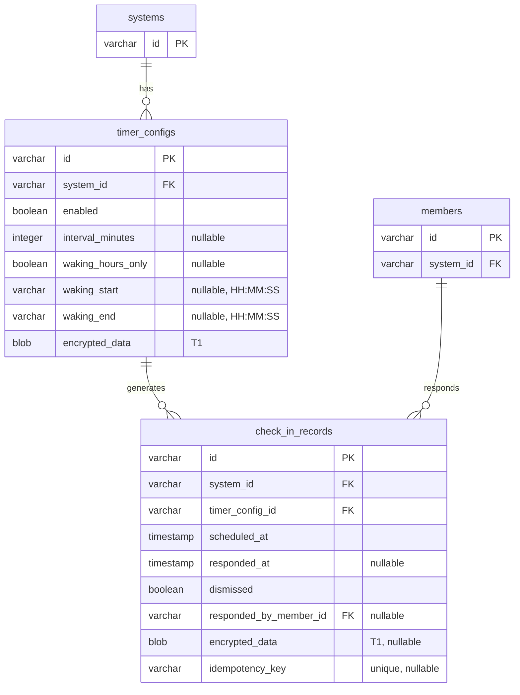
```mermaid
erDiagram
    systems {
        varchar id PK
    }

    members {
        varchar id PK
        varchar system_id FK
    }

    timer_configs {
        varchar id PK
        varchar system_id FK
        boolean enabled
        integer interval_minutes "nullable"
        boolean waking_hours_only "nullable"
        varchar waking_start "nullable, HH:MM:SS"
        varchar waking_end "nullable, HH:MM:SS"
        blob encrypted_data "T1"
    }

    check_in_records {
        varchar id PK
        varchar system_id FK
        varchar timer_config_id FK
        timestamp scheduled_at
        timestamp responded_at "nullable"
        boolean dismissed
        varchar responded_by_member_id FK "nullable"
        blob encrypted_data "T1, nullable"
        varchar idempotency_key "unique, nullable"
    }

    systems ||--o{ timer_configs : "has"
    timer_configs ||--o{ check_in_records : "generates"
    members ||--o{ check_in_records : "responds"
```

**Notes:**

- `check_in_records` has a partial index on `(system_id, scheduled_at)` WHERE `responded_at IS NULL AND dismissed = false AND archived = false` for efficient pending check-in queries.
- `idempotency_key` prevents duplicate record generation by the scheduling worker.

---

## 6. Analytics

Pre-computed fronting reports cached for dashboard display.

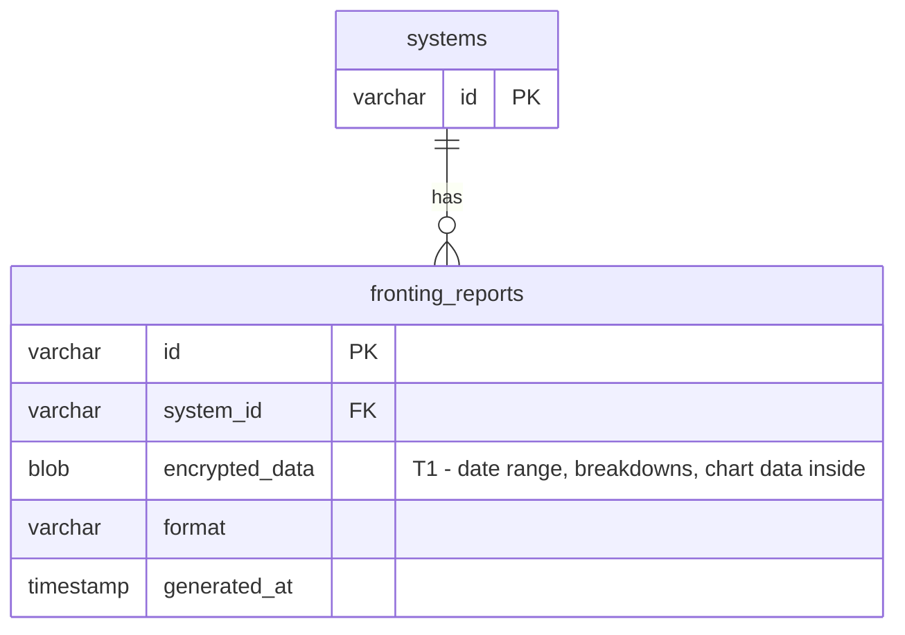
```mermaid
erDiagram
    systems {
        varchar id PK
    }

    fronting_reports {
        varchar id PK
        varchar system_id FK
        blob encrypted_data "T1 - date range, breakdowns, chart data inside"
        varchar format
        timestamp generated_at
    }

    systems ||--o{ fronting_reports : "has"
```

---

## 7. System Snapshots

Point-in-time snapshots of system structure state. The encrypted blob contains the full serialized state of members, structure, groups, and innerworld. Trigger values: `manual`, `scheduled-daily`, `scheduled-weekly`.

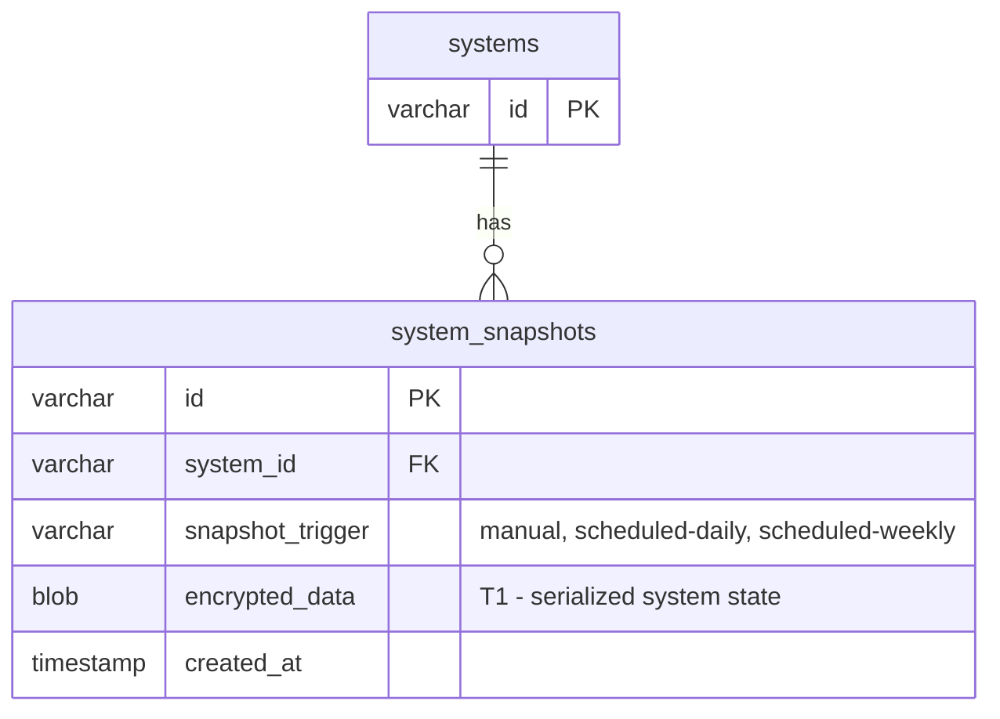
```mermaid
erDiagram
    systems {
        varchar id PK
    }

    system_snapshots {
        varchar id PK
        varchar system_id FK
        varchar snapshot_trigger "manual, scheduled-daily, scheduled-weekly"
        blob encrypted_data "T1 - serialized system state"
        timestamp created_at
    }

    systems ||--o{ system_snapshots : "has"
```

---

## 8. Privacy (Buckets & Friends)

Privacy Buckets use tag-based intersection logic to control which content is visible to which friends. Bucket keys are T2 (per-bucket symmetric keys). Friend connections and friend codes are account-level (not system-level). Friend connections are directional — A→B and B→A are separate rows.

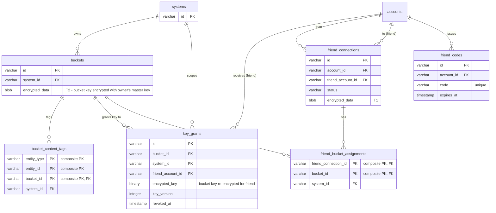
```mermaid
erDiagram
    systems {
        varchar id PK
    }

    buckets {
        varchar id PK
        varchar system_id FK
        blob encrypted_data "T2 - bucket key encrypted with owner's master key"
    }

    bucket_content_tags {
        varchar entity_type PK "composite PK"
        varchar entity_id PK "composite PK"
        varchar bucket_id PK "composite PK, FK"
        varchar system_id FK
    }

    key_grants {
        varchar id PK
        varchar bucket_id FK
        varchar system_id FK
        varchar friend_account_id FK
        binary encrypted_key "bucket key re-encrypted for friend"
        integer key_version
        timestamp revoked_at
    }

    friend_connections {
        varchar id PK
        varchar account_id FK
        varchar friend_account_id FK
        varchar status
        blob encrypted_data "T1"
    }

    friend_codes {
        varchar id PK
        varchar account_id FK
        varchar code "unique"
        timestamp expires_at
    }

    friend_bucket_assignments {
        varchar friend_connection_id PK "composite PK, FK"
        varchar bucket_id PK "composite PK, FK"
        varchar system_id FK
    }

    systems ||--o{ buckets : "owns"
    buckets ||--o{ bucket_content_tags : "tags"
    buckets ||--o{ key_grants : "grants key to"
    systems ||--o{ key_grants : "scopes"
    accounts ||--o{ key_grants : "receives (friend)"
    accounts ||--o{ friend_connections : "from"
    accounts ||--o{ friend_connections : "to (friend)"
    accounts ||--o{ friend_codes : "issues"
    friend_connections ||--o{ friend_bucket_assignments : "has"
    buckets ||--o{ friend_bucket_assignments : "assigned in"
```

**Note:** `bucket_content_tags.entity_id` has no FK constraint — it is a polymorphic reference to any taggable entity (member, fronting session, journal entry, etc.), identified by `entity_type`. Referential integrity is enforced at the application layer.

---

## 9. Journal & Wiki

Journal entries can be linked to a fronting session for contextual tracking. Wiki pages are identified by a server-side slug hash.

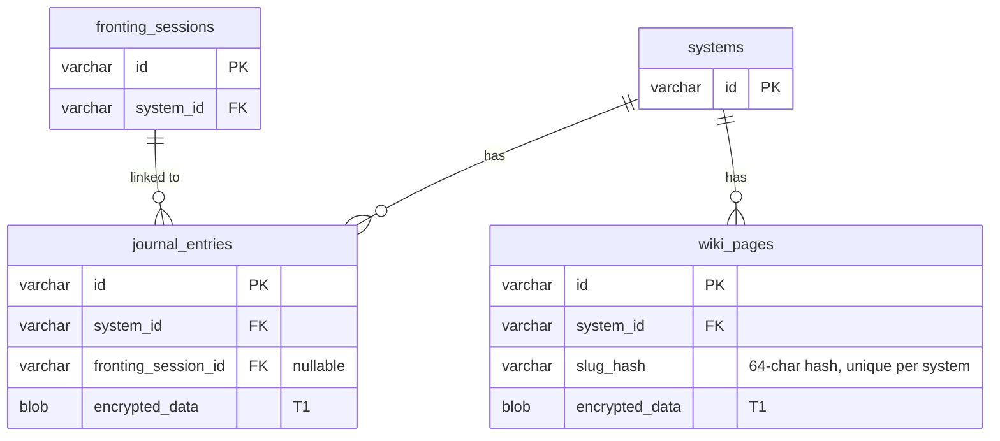
```mermaid
erDiagram
    systems {
        varchar id PK
    }

    fronting_sessions {
        varchar id PK
        varchar system_id FK
    }

    journal_entries {
        varchar id PK
        varchar system_id FK
        varchar fronting_session_id FK "nullable"
        blob encrypted_data "T1"
    }

    wiki_pages {
        varchar id PK
        varchar system_id FK
        varchar slug_hash "64-char hash, unique per system"
        blob encrypted_data "T1"
    }

    systems ||--o{ journal_entries : "has"
    fronting_sessions ||--o{ journal_entries : "linked to"
    systems ||--o{ wiki_pages : "has"
```

---

## 10. Innerworld

The system's internal mental landscape. Regions are hierarchical (parent/child). Entities (characters, objects, locations) live in regions. The canvas is a 1:1 per-system layout document.

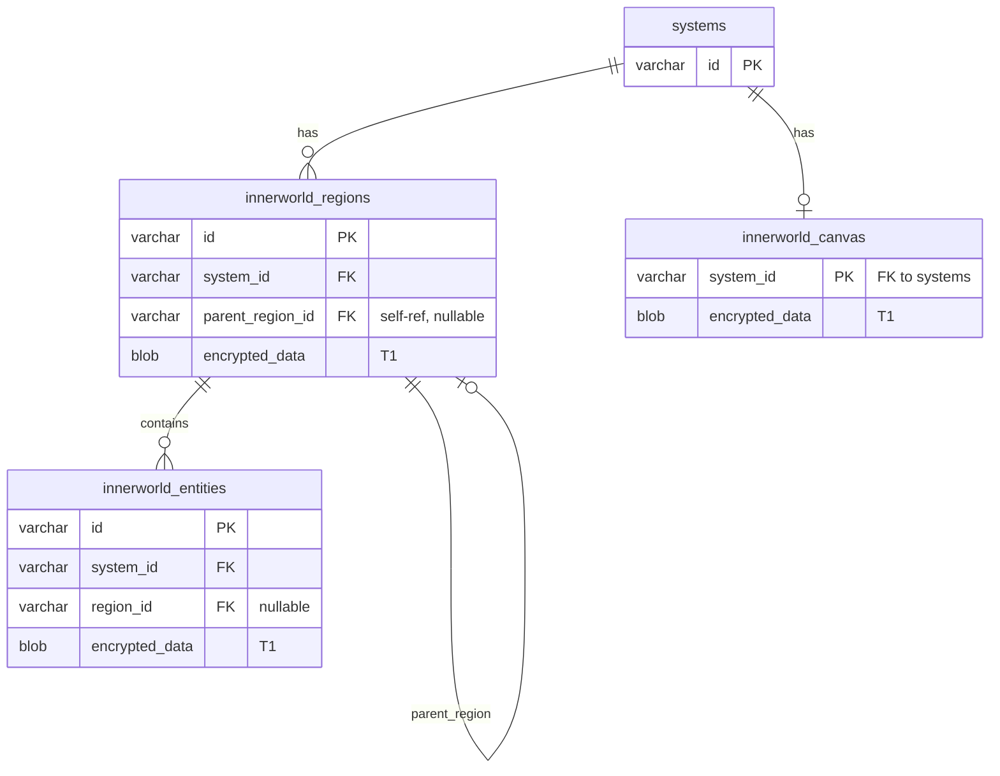
```mermaid
erDiagram
    systems {
        varchar id PK
    }

    innerworld_regions {
        varchar id PK
        varchar system_id FK
        varchar parent_region_id FK "self-ref, nullable"
        blob encrypted_data "T1"
    }

    innerworld_entities {
        varchar id PK
        varchar system_id FK
        varchar region_id FK "nullable"
        blob encrypted_data "T1"
    }

    innerworld_canvas {
        varchar system_id PK "FK to systems"
        blob encrypted_data "T1"
    }

    systems ||--o{ innerworld_regions : "has"
    innerworld_regions ||--o| innerworld_regions : "parent_region"
    innerworld_regions ||--o{ innerworld_entities : "contains"
    systems ||--o| innerworld_canvas : "has"
```

---

## 11. Custom Fields

System-defined fields with configurable scope. Fields can target members, groups, structure entity types, or the system as a whole. Values are per-member, per-group, per-structure-entity, or system-level. Scope targeting is defined via `field_definition_scopes`. Visibility is controlled per-bucket.

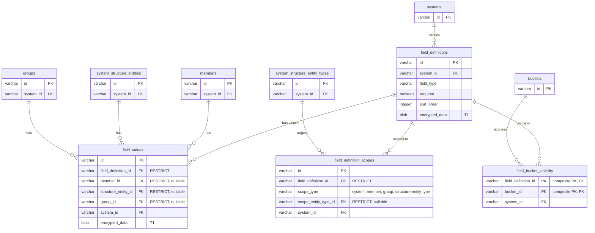
```mermaid
erDiagram
    systems {
        varchar id PK
    }

    members {
        varchar id PK
        varchar system_id FK
    }

    groups {
        varchar id PK
        varchar system_id FK
    }

    system_structure_entities {
        varchar id PK
        varchar system_id FK
    }

    system_structure_entity_types {
        varchar id PK
        varchar system_id FK
    }

    buckets {
        varchar id PK
    }

    field_definitions {
        varchar id PK
        varchar system_id FK
        varchar field_type
        boolean required
        integer sort_order
        blob encrypted_data "T1"
    }

    field_definition_scopes {
        varchar id PK
        varchar field_definition_id FK "RESTRICT"
        varchar scope_type "system, member, group, structure-entity-type"
        varchar scope_entity_type_id FK "RESTRICT, nullable"
        varchar system_id FK
    }

    field_values {
        varchar id PK
        varchar field_definition_id FK "RESTRICT"
        varchar member_id FK "RESTRICT, nullable"
        varchar structure_entity_id FK "RESTRICT, nullable"
        varchar group_id FK "RESTRICT, nullable"
        varchar system_id FK
        blob encrypted_data "T1"
    }

    field_bucket_visibility {
        varchar field_definition_id PK "composite PK, FK"
        varchar bucket_id PK "composite PK, FK"
        varchar system_id FK
    }

    systems ||--o{ field_definitions : "defines"
    field_definitions ||--o{ field_definition_scopes : "scoped to"
    system_structure_entity_types ||--o{ field_definition_scopes : "targets"
    field_definitions ||--o{ field_values : "has values"
    members ||--o{ field_values : "has"
    system_structure_entities ||--o{ field_values : "has"
    groups ||--o{ field_values : "has"
    field_definitions ||--o{ field_bucket_visibility : "visible in"
    buckets ||--o{ field_bucket_visibility : "exposes"
```

**Notes:**

- `field_values` has a mutual exclusivity CHECK on `(member_id, structure_entity_id, group_id)` — at most one can be non-null. When all three are null, the value is system-level. Partial unique indexes enforce one value per definition per owner.
- `field_definition_scopes` has a CHECK: `scope_entity_type_id` must be null unless `scope_type = 'structure-entity-type'`. Unique on `(field_definition_id, scope_type, scope_entity_type_id)` — in PostgreSQL via NULLS NOT DISTINCT; in SQLite via a partial unique index on the null case.

---

## 12. Sync

CRDT-based offline sync infrastructure. `sync_documents` tracks Automerge document state per entity. `sync_queue` is the ordered change log. `sync_conflicts` records unresolved or resolved CRDT merges.

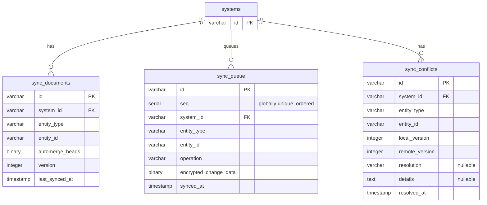
```mermaid
erDiagram
    systems {
        varchar id PK
    }

    sync_documents {
        varchar id PK
        varchar system_id FK
        varchar entity_type
        varchar entity_id
        binary automerge_heads
        integer version
        timestamp last_synced_at
    }

    sync_queue {
        varchar id PK
        serial seq "globally unique, ordered"
        varchar system_id FK
        varchar entity_type
        varchar entity_id
        varchar operation
        binary encrypted_change_data
        timestamp synced_at
    }

    sync_conflicts {
        varchar id PK
        varchar system_id FK
        varchar entity_type
        varchar entity_id
        integer local_version
        integer remote_version
        varchar resolution "nullable"
        text details "nullable"
        timestamp resolved_at
    }

    systems ||--o{ sync_documents : "has"
    systems ||--o{ sync_queue : "queues"
    systems ||--o{ sync_conflicts : "has"
```

---

## 13. Notifications

Push notification device registration, per-event-type config, and friend-specific notification preferences.

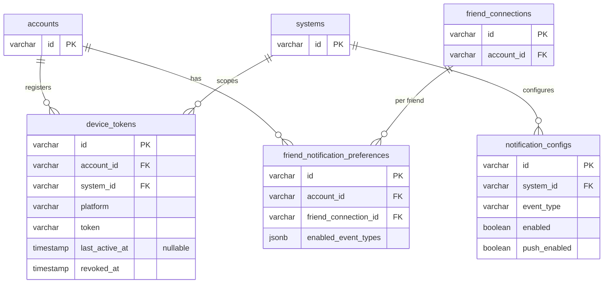
```mermaid
erDiagram
    accounts {
        varchar id PK
    }

    systems {
        varchar id PK
    }

    friend_connections {
        varchar id PK
        varchar account_id FK
    }

    device_tokens {
        varchar id PK
        varchar account_id FK
        varchar system_id FK
        varchar platform
        varchar token
        timestamp last_active_at "nullable"
        timestamp revoked_at
    }

    notification_configs {
        varchar id PK
        varchar system_id FK
        varchar event_type
        boolean enabled
        boolean push_enabled
    }

    friend_notification_preferences {
        varchar id PK
        varchar account_id FK
        varchar friend_connection_id FK
        jsonb enabled_event_types
    }

    accounts ||--o{ device_tokens : "registers"
    systems ||--o{ device_tokens : "scopes"
    systems ||--o{ notification_configs : "configures"
    accounts ||--o{ friend_notification_preferences : "has"
    friend_connections ||--o{ friend_notification_preferences : "per friend"
```

---

## 14. Jobs & Lifecycle

Import/export pipelines, account purge lifecycle, and application-domain lifecycle events (e.g., member discovery milestones). Audit log is append-only and partitioned by timestamp in production.

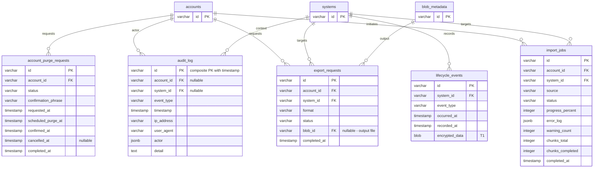
```mermaid
erDiagram
    accounts {
        varchar id PK
    }

    systems {
        varchar id PK
    }

    blob_metadata {
        varchar id PK
    }

    import_jobs {
        varchar id PK
        varchar account_id FK
        varchar system_id FK
        varchar source
        varchar status
        integer progress_percent
        jsonb error_log
        integer warning_count
        integer chunks_total
        integer chunks_completed
        timestamp completed_at
    }

    export_requests {
        varchar id PK
        varchar account_id FK
        varchar system_id FK
        varchar format
        varchar status
        varchar blob_id FK "nullable - output file"
        timestamp completed_at
    }

    account_purge_requests {
        varchar id PK
        varchar account_id FK
        varchar status
        varchar confirmation_phrase
        timestamp requested_at
        timestamp scheduled_purge_at
        timestamp confirmed_at
        timestamp cancelled_at "nullable"
        timestamp completed_at
    }

    lifecycle_events {
        varchar id PK
        varchar system_id FK
        varchar event_type
        timestamp occurred_at
        timestamp recorded_at
        blob encrypted_data "T1"
    }

    audit_log {
        varchar id PK "composite PK with timestamp"
        varchar account_id FK "nullable"
        varchar system_id FK "nullable"
        varchar event_type
        timestamp timestamp
        varchar ip_address
        varchar user_agent
        jsonb actor
        text detail
    }

    accounts ||--o{ import_jobs : "initiates"
    systems ||--o{ import_jobs : "targets"
    accounts ||--o{ export_requests : "requests"
    systems ||--o{ export_requests : "targets"
    blob_metadata ||--o{ export_requests : "output"
    accounts ||--o{ account_purge_requests : "requests"
    systems ||--o{ lifecycle_events : "records"
    accounts ||--o{ audit_log : "actor"
    systems ||--o{ audit_log : "context"
```

---

## 15. Media & Blob

S3-compatible blob storage metadata. Each blob belongs to a system and optionally to a privacy bucket (T2) or uses the system key (T1). Thumbnails self-reference the table.

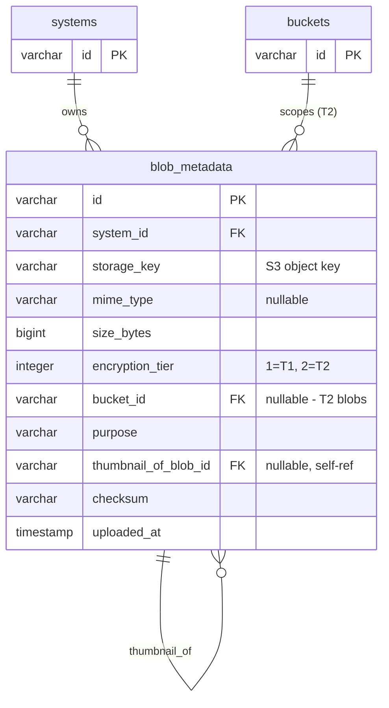
```mermaid
erDiagram
    systems {
        varchar id PK
    }

    buckets {
        varchar id PK
    }

    blob_metadata {
        varchar id PK
        varchar system_id FK
        varchar storage_key "S3 object key"
        varchar mime_type "nullable"
        bigint size_bytes
        integer encryption_tier "1=T1, 2=T2"
        varchar bucket_id FK "nullable - T2 blobs"
        varchar purpose
        varchar thumbnail_of_blob_id FK "nullable, self-ref"
        varchar checksum
        timestamp uploaded_at
    }

    systems ||--o{ blob_metadata : "owns"
    buckets ||--o{ blob_metadata : "scopes (T2)"
    blob_metadata ||--o{ blob_metadata : "thumbnail_of"
```

---

## 16. API Keys & Webhooks

Programmatic API access (public REST API) and outbound webhook delivery. API keys can be scoped to specific buckets. Webhook configs reference an optional crypto API key for payload signing.

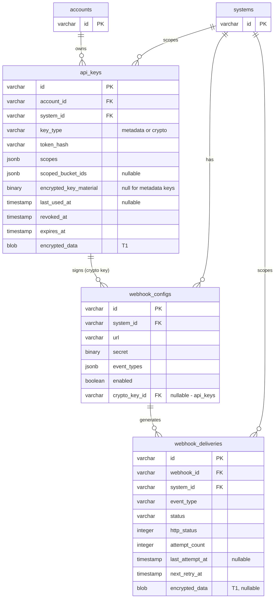
```mermaid
erDiagram
    accounts {
        varchar id PK
    }

    systems {
        varchar id PK
    }

    api_keys {
        varchar id PK
        varchar account_id FK
        varchar system_id FK
        varchar key_type "metadata or crypto"
        varchar token_hash
        jsonb scopes
        jsonb scoped_bucket_ids "nullable"
        binary encrypted_key_material "null for metadata keys"
        timestamp last_used_at "nullable"
        timestamp revoked_at
        timestamp expires_at
        blob encrypted_data "T1"
    }

    webhook_configs {
        varchar id PK
        varchar system_id FK
        varchar url
        binary secret
        jsonb event_types
        boolean enabled
        varchar crypto_key_id FK "nullable - api_keys"
    }

    webhook_deliveries {
        varchar id PK
        varchar webhook_id FK
        varchar system_id FK
        varchar event_type
        varchar status
        integer http_status
        integer attempt_count
        timestamp last_attempt_at "nullable"
        timestamp next_retry_at
        blob encrypted_data "T1, nullable"
    }

    accounts ||--o{ api_keys : "owns"
    systems ||--o{ api_keys : "scopes"
    systems ||--o{ webhook_configs : "has"
    api_keys ||--o{ webhook_configs : "signs (crypto key)"
    webhook_configs ||--o{ webhook_deliveries : "generates"
    systems ||--o{ webhook_deliveries : "scopes"
```

---

## 17. Integration (PK Bridge & Safe Mode)

PluralKit bridge state for bidirectional sync. Safe mode content is simplified UI content for Littles Mode.

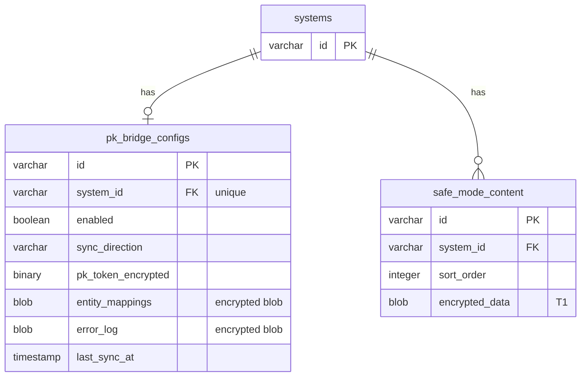
```mermaid
erDiagram
    systems {
        varchar id PK
    }

    pk_bridge_configs {
        varchar id PK
        varchar system_id FK "unique"
        boolean enabled
        varchar sync_direction
        binary pk_token_encrypted
        blob entity_mappings "encrypted blob"
        blob error_log "encrypted blob"
        timestamp last_sync_at
    }

    safe_mode_content {
        varchar id PK
        varchar system_id FK
        integer sort_order
        blob encrypted_data "T1"
    }

    systems ||--o| pk_bridge_configs : "has"
    systems ||--o{ safe_mode_content : "has"
```

---

## 18. Key Rotation

Tracks in-progress and completed bucket key rotation jobs. Each rotation re-encrypts all T2 content tagged to a bucket from the old key version to the new one. Workers claim items to process.

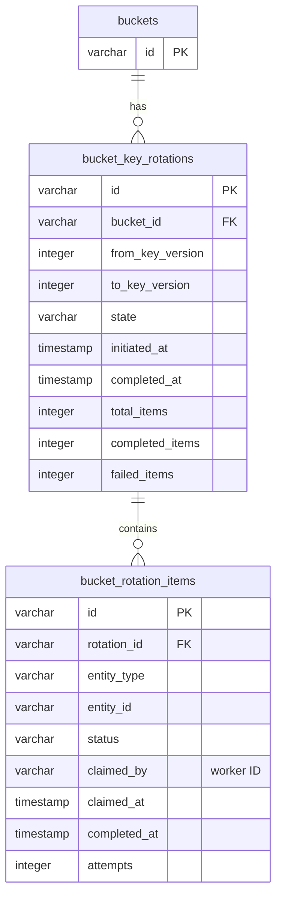
```mermaid
erDiagram
    buckets {
        varchar id PK
    }

    bucket_key_rotations {
        varchar id PK
        varchar bucket_id FK
        integer from_key_version
        integer to_key_version
        varchar state
        timestamp initiated_at
        timestamp completed_at
        integer total_items
        integer completed_items
        integer failed_items
    }

    bucket_rotation_items {
        varchar id PK
        varchar rotation_id FK
        varchar entity_type
        varchar entity_id
        varchar status
        varchar claimed_by "worker ID"
        timestamp claimed_at
        timestamp completed_at
        integer attempts
    }

    buckets ||--o{ bucket_key_rotations : "has"
    bucket_key_rotations ||--o{ bucket_rotation_items : "contains"
```

---

## 19. Search

Full-text search index maintained as a derived table. Populated/invalidated by application-layer triggers after entity writes. Not directly owned by any domain entity via FK.

```mermaid
erDiagram
    search_index {
        varchar system_id PK "composite PK"
        varchar entity_type PK "composite PK"
        varchar entity_id PK "composite PK"
        text title "NOT NULL, default empty"
        text content "NOT NULL, default empty"
        tsvector search_vector "GENERATED from title + content"
    }
```

**Note:** `search_index` has no FK constraints by design — it is a derived/cached table populated via raw DDL (not Drizzle). `search_vector` is a `GENERATED ALWAYS AS` column using weighted tsvector (`title` = A, `content` = B). Self-hosted only — cloud deployments must not populate this table (search remains client-side via SQLite FTS5). Stale entries are tolerated and cleaned up via `rebuildSearchIndex`.

---

## Cross-Domain FK Summary

The following diagram shows only the high-level ownership chain across domains, omitting per-domain detail:

```mermaid
erDiagram
    accounts ||--|| systems : "owns"
    accounts ||--o{ sessions : "has"
    accounts ||--o{ auth_keys : "has"
    accounts ||--o{ api_keys : "owns"
    accounts ||--o{ friend_connections : "has"
    systems ||--o{ members : "contains"
    systems ||--o{ system_structure_entity_types : "defines"
    systems ||--o{ system_structure_entities : "contains"
    systems ||--o{ buckets : "owns"
    systems ||--o{ fronting_sessions : "tracks"
    systems ||--o{ channels : "has"
    systems ||--o{ journal_entries : "has"
    systems ||--o{ system_snapshots : "snapshots"
    systems ||--o{ sync_documents : "syncs"
    buckets ||--o{ key_grants : "grants"
    buckets ||--o{ bucket_content_tags : "tags"
    buckets ||--o{ bucket_key_rotations : "rotates"
    fronting_sessions ||--o{ fronting_comments : "has"
    fronting_sessions ||--o{ journal_entries : "linked"
    channels ||--o{ messages : "contains"
    members ||--o{ group_memberships : "belongs to"
    members ||--o{ fronting_sessions : "fronts in"
    system_structure_entities ||--o{ fronting_sessions : "fronts in"
    system_structure_entities ||--o{ field_values : "has"
```
